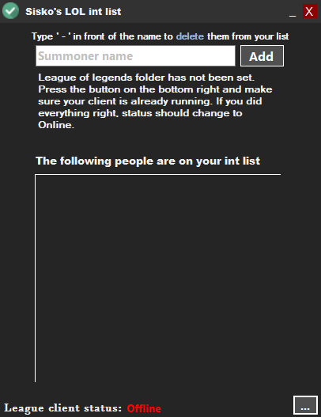

# Sisko's LeagueOfLegends Int List
An external application that makes use of the official League of Legends API to create an int list. The program saves all summoners in a file and can even delete them by putting 
a `-` in front of the summoner name. When active, it will read the League of Legends client process and once in champion select, will go through your teammates' summoner names.

When a player is found to be in your int list, the program will pop-up to the front screen and also make a quick "pop" sound. It will then list the summoner(s) that have been
found to be in your int list. 

  

## Usage
- After opening the application for the first time, you have to set the League of Legends folder. Most of the time this is located in the C: drive under Program Files.
- You add people to your int list by typing their summoner name in the white bar and by pressing the "Add" button.
- You remove people from your int list by typing their summoner name with a `-` in front and by pressing the "Add" button.
- Going into a champion select lobby will automatically trigger the program to go through the checking process. If it finds someone in your int list, it will pop-up by itself
with a little sound effect to let you know. Simply keep the program running while you play the game and it will handle the rest.
